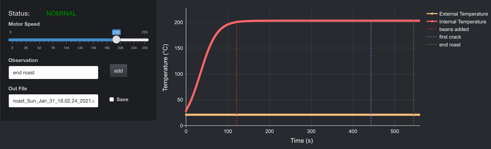

# WhirleypopeR

##### WhirleypopeR is a repository for automated stovetop coffee roasting. This includes a web application to monitor and log roasts:

##### From the app interface, you can:
*   Monitor temperature profiles

*   Control stir speed

*   Add observations (e.g. Time to first crack)

*   Log the data in a csv file for future reference

##### To communicate with the arduino, WhirelypopeR uses functions provided by the [arduinor package](https://github.com/r-arduino/arduinor).

##### Hardware details to come...
